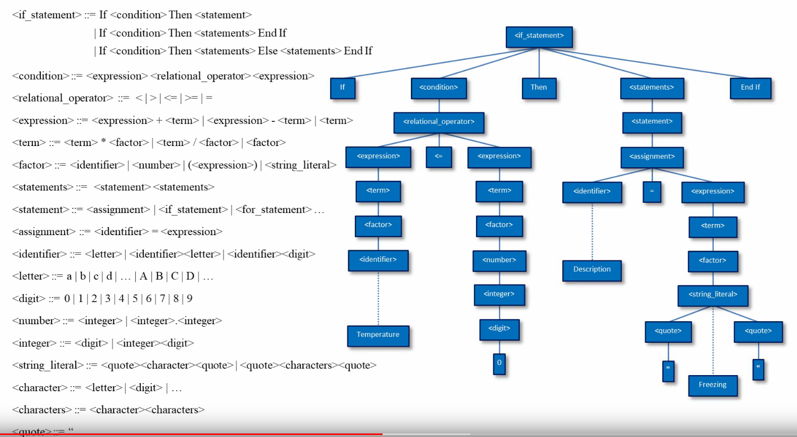

# Synthetic : Grammar Checking

## TODO

- [ ] Parse tree for simple example
- [ ] LaTeX rendition
- [ ] Note that each statement is a rule provided by the *statements* rule, it is recursively defined to encompass one or more repetitions!
    - [ ] [Optional Tokens](https://stackoverflow.com/a/2669581)
    - [ ] [More than one](https://stackoverflow.com/questions/29235967/bison-one-or-more-occurrences-in-grammar-file)
    - [ ] TL;DR : Bison is a LALR parser, therefore cannot support extended BNF
    - [ ] Also I am sleep deprived so please ask me what the absolute fuck I was thinking during this time of writing...English sucks
- [ ] Variable retrieval for addition, subtraction, multiplication, division
- [ ] We used GNU Bison for parse tree generation because FUCK THAT
- [ ] [Mad props to this fool](https://github.com/ezaquarii/bison-flex-cpp-example)
    - [ ] I LOVE YOU EZAQUARII, i will get your name tattooed on my body



## Types

- `bool`
- `long long int`
- `float`

## Rules

- `assignment`
- `statements` -> `statement`
    * `if_statement`
    * `for_statement`
    * `while_statement`


## Process

- source file read in
- Gets lexxed (Flex) -> probably MUCH faster than lexi
- token stream is fed into GNU Bison
- Token stream is then checked against grammar rules (GNU Bison) -> semantical analysis can be completed here too
- AST Generated for object code generation and further semantic analysis
- All tests can be found in `inputs/`

## Control Flow

### If Else Branching

Notation:

```
<if_statement> ::= IF <condition> THEN <statement>
                   | IF <condition> THEN <statements> ENDIF
                   | IF <condition> THEN <statements> ELSE <statement> ENDIF
```

Example code:

```
! Depth one (do the parse tree of this one for simplicitity) !

if (1 < 2) then 
    int v = 100; 
endif


! Depth two or more statements (recursive) !

if (1 < 2) then 
    int v = 100;
    int c = 1000;
else
    int v = 1000;
endif

! Nested if's !

if (1 > 100) then
    if (100 > 99) then
        int val = 10;
        int c = 100;
    endif
endif

! Nested if's with other statements !

if(1 > 100) then
    int value = 100;
    int another = 1000;
else
    if (100 < 0) then
        int something = 10;
    endif
    int another = 1000;
endif

! if condition with literal true and false !

if (true) then
    int value = 100;
endif

if (false) then
    int value = 100;
endif
```

### While Loop

Notation:

```
while_condition ::= WHILE condition statements WHILEEND
                    | DO statement WHILE condition DOEND
                    | DO statements WHILE condition DOEND
```

Example code:

```
! Traditional while loop that makes no sense (infinite loop)!

while (1 < 2)
    int value = 100;
whileend

! Do while loop that is absolutely fuckered !

do
  int value = 1;
while (1 < 2)
doend
```

### For Loop

Notation:

```
for_statement ::= FOR LEFTPAR PRIMITIVE_TYPE ID ASSIGN expression SEMICOLON ID RELATIONAL_OP expression SEMICOLON ID_INC RIGHTPAR statements FOREND
                  | FOR LEFTPAR PRIMITIVE_TYPE ID ASSIGN expression SEMICOLON ID RELATIONAL_OP expression SEMICOLON ID_DEC RIGHTPAR statements FOREND
```

Example code: 

```
for (int i = 0; i < 10; i++)
    int first = 0;
    for (int i = 0; i < 10; i++)
        int second = 0;
    forend
forend


for (int i = 0; i < 10; ++i)
    int first = 0;
    for (int i = 0; i < 10; ++i)
        int second = 0;
    forend
forend


for (int i = 0; i < 10; --i)
    int first = 0;
    for (int i = 0; i < 10; --i)
        int second = 0;
    forend
forend

```

## Statements

### Addition and Subtraction

Notation:

```
expression ::= <expression> + <expression>
               | <expression> - <expression>
               | <term>
```

Example code:

```
! Evaluates to 2 !
1 + 1
(1 + 1)

(3232 + 213322)
```

**Note**

- expression is defined as a long long int, therefore operations only work for non floating point numbers. 
- The symbol table is a string -> float, so converting long long int (unsigned 64 bit integer) to float loses no information


### Multiplication and Division

Notation:

```
term := <term> * <factor>
        | <term> / <factor>
        | <factor>
```

Example code:

```
5 * 10 * 80
(5 * 9 * 190)
int value = 1 * 2 * 3;
int another = 1 / 3 / 3;
value = 1 / 2;
another = 1 * 10;
! Currently variable retrieval is broken therefore this would thrown an error !
a * 10
```

### Assignment

Notation:

```
assignment : PRIMITIVE_TYPE ID SEMICOLON 
             | PRIMITIVE_TYPE ID ASSIGN expression SEMICOLON
             | ID ASSIGN expression SEMICOLON
             | PRIMITIVE_TYPE ID ASSIGN term SEMICOLON
             | ID ASSIGN term SEMICOLON
```

Example code: 

```
int value = 1 * 2 * 3;
int another = 1 / 3 / 3;
value = 1 / 2;
another = 1 * 10;
```

**Note**:

- recursively defined as a statement too
- therefore can be used in mutliple lines of statements
